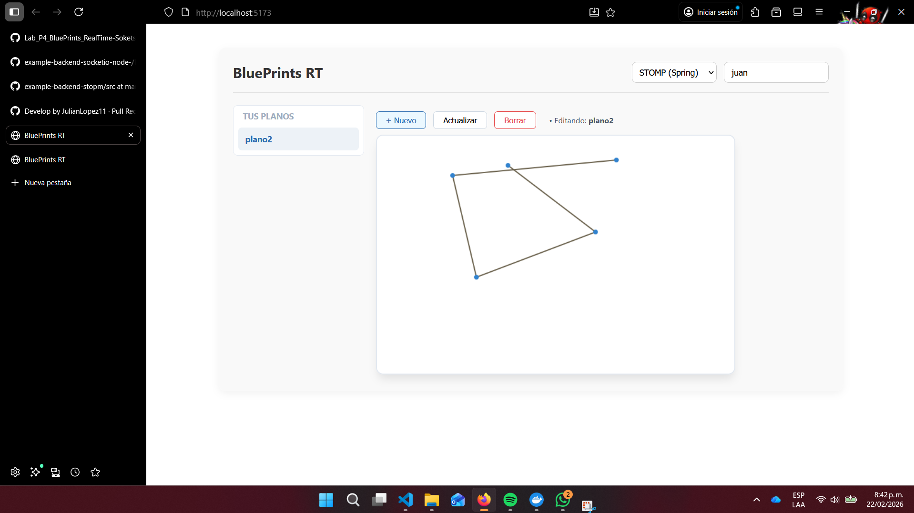
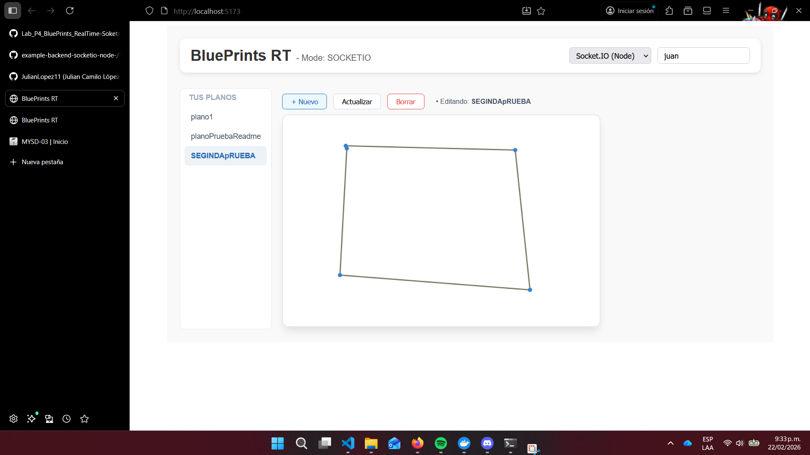

# Lab P4 — BluePrints en Tiempo Real (Sockets & STOMP)

> **Repositorio:** `DECSIS-ECI/Lab_P4_BluePrints_RealTime-Sokets`  
> **Front:** React + Vite (Canvas, CRUD, y selector de tecnología RT)  
> **Backends guía (elige uno o compáralos):**
> - **Socket.IO (Node.js):** https://github.com/DECSIS-ECI/example-backend-socketio-node-/blob/main/README.md
> - **STOMP (Spring Boot):** https://github.com/DECSIS-ECI/example-backend-stopm/tree/main

## 🎯 Objetivo del laboratorio
Implementar **colaboración en tiempo real** para el caso de BluePrints. El Front consume la API CRUD de la Parte 3 (o equivalente) y habilita tiempo real usando **Socket.IO** o **STOMP**, para que múltiples clientes dibujen el mismo plano de forma simultánea.

Al finalizar, el equipo debe:
1. Integrar el Front con su **API CRUD** (listar/crear/actualizar/eliminar planos, y total de puntos por autor).
2. Conectar el Front a un backend de **tiempo real** (Socket.IO **o** STOMP) siguiendo los repos guía.
3. Demostrar **colaboración en vivo** (dos pestañas navegando el mismo plano).

---

## 🧩 Alcance y criterios funcionales
- **CRUD** (REST):
  - `GET /api/blueprints?author=:author` → lista por autor (incluye total de puntos).
  - `GET /api/blueprints/:author/:name` → puntos del plano.
  - `POST /api/blueprints` → crear.
  - `PUT /api/blueprints/:author/:name` → actualizar.
  - `DELETE /api/blueprints/:author/:name` → eliminar.
- **Tiempo real (RT)** (elige uno):
  - **Socket.IO** (rooms): `join-room`, `draw-event` → broadcast `blueprint-update`.
  - **STOMP** (topics): `@MessageMapping("/draw")` → `convertAndSend(/topic/blueprints.{author}.{name})`.
- **UI**:
  - Canvas con **dibujo por clic** (incremental).
  - Panel del autor: **tabla** de planos y **total de puntos** (`reduce`).
  - Barra de acciones: **Create / Save/Update / Delete** y **selector de tecnología** (None / Socket.IO / STOMP).
- **DX/Calidad**: código limpio, manejo de errores, README de equipo.

---

## 🏗️ Arquitectura (visión rápida)

```
React (Vite)
 ├─ HTTP (REST CRUD + estado inicial) ───────────────> Tu API (P3 / propia)
 └─ Tiempo Real (elige uno):
     ├─ Socket.IO: join-room / draw-event ──────────> Socket.IO Server (Node)
     └─ STOMP: /app/draw -> /topic/blueprints.* ────> Spring WebSocket/STOMP
```

**Convenciones recomendadas**  
- **Plano como canal/sala**: `blueprints.{author}.{name}`  
- **Payload de punto**: `{ x, y }`

---

## 📦 Repos guía (clona/consulta)
- **Socket.IO (Node.js)**: https://github.com/DECSIS-ECI/example-backend-socketio-node-/blob/main/README.md  
  - *Uso típico en el cliente:* `io(VITE_IO_BASE, { transports: ['websocket'] })`, `join-room`, `draw-event`, `blueprint-update`.
- **STOMP (Spring Boot)**: https://github.com/DECSIS-ECI/example-backend-stopm/tree/main  
  - *Uso típico en el cliente:* `@stomp/stompjs` → `client.publish('/app/draw', body)`; suscripción a `/topic/blueprints.{author}.{name}`.

---

## ⚙️ Variables de entorno (Front)
Crea `.env.local` en la raíz del proyecto **Front**:
```bash
# REST (tu backend CRUD)
VITE_API_BASE=http://localhost:8080

# Tiempo real: apunta a uno u otro según el backend que uses
VITE_IO_BASE=http://localhost:3001     # si usas Socket.IO (Node)
VITE_STOMP_BASE=http://localhost:8080  # si usas STOMP (Spring)
```
En la UI, selecciona la tecnología en el **selector RT**.

---

## 🚀 Puesta en marcha

### 1) Backend RT (elige uno)

**Opción A — Socket.IO (Node.js)**  
Sigue el README del repo guía:  
https://github.com/DECSIS-ECI/example-backend-socketio-node-/blob/main/README.md
```bash
npm i
npm run dev
# expone: http://localhost:3001
# prueba rápida del estado inicial:
curl http://localhost:3001/api/blueprints/juan/plano-1
```

**Opción B — STOMP (Spring Boot)**  
Sigue el repo guía:  
https://github.com/DECSIS-ECI/example-backend-stopm/tree/main
```bash
./mvnw spring-boot:run
# expone: http://localhost:8080
# endpoint WS (ej.): /ws-blueprints
```

### 2) Front (este repo)
```bash
npm i
npm run dev
# http://localhost:5173
```
En la interfaz: selecciona **Socket.IO** o **STOMP**, define `author` y `name`, abre **dos pestañas** y dibuja en el canvas (clics).

---

## 🔌 Protocolos de Tiempo Real (detalle mínimo)

### A) Socket.IO
- **Unirse a sala**
  ```js
  socket.emit('join-room', `blueprints.${author}.${name}`)
  ```
- **Enviar punto**
  ```js
  socket.emit('draw-event', { room, author, name, point: { x, y } })
  ```
- **Recibir actualización**
  ```js
  socket.on('blueprint-update', (upd) => { /* append points y repintar */ })
  ```

### B) STOMP
- **Publicar punto**
  ```js
  client.publish({ destination: '/app/draw', body: JSON.stringify({ author, name, point }) })
  ```
- **Suscribirse a tópico**
  ```js
  client.subscribe(`/topic/blueprints.${author}.${name}`, (msg) => { /* append points y repintar */ })
  ```


---

## Comparativa SOCKETIO vs STOMP

Socket.IO y STOMP son tecnologías utilizadas para la comunicación en tiempo real, pero operan de manera diferente. Socket.IO es una biblioteca basada en `WebSockets` que permite comunicación bidireccional entre cliente y servidor de forma sencilla y eficiente y como lo he visto en materias anteriores y en esta es ideal para temas como chats o en este caso un interactivo para dibujar. El STOMP es un protocolo de mensajería que funciona sobre WebSockets  y está diseñado para integrarse con brokers de mensajería enfocándose en un modelo de publicar y consumir garantizando un enrutamiento estructurado de mensajes. 
Se podria decir que socketIO es mas versatil y flexible mientras que los STOMPS son mas robustos y dependen de los protocolos de mensajeria 
---


## Evidencia Stomp


---

---

## Evidencia Socket IO


---


## 📄 Licencia
MIT (o la definida por el curso/equipo).

## Autor

* **Julian Camilo Lopez Barrero** - [JulianLopez11](https://github.com/JulianLopez11)
